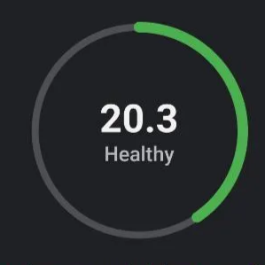
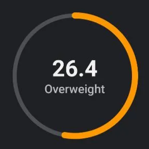
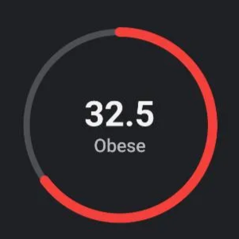

# AnimatedCircularIndicator

A reusable and customizable animated circular indicator
for displaying numeric metrics in Jetpack Compose.

This component is designed to be generic and flexible,
so it can be used for BMI, battery level, progress tracking,
health stats, and other data visualizations.

---

## 📸 Preview

### Healthy


### Overweight


### Obese


---

## ✨ Features

- Smooth animated transitions
- Supports any numeric range
- Custom color mapping
- Pluggable center content
- Lightweight and dependency-free
- Built with Jetpack Compose

---

## 🚀 Basic Usage

```kotlin
AnimatedCircularIndicator(
    value = 72f,
    minValue = 0f,
    maxValue = 100f,
    modifier = Modifier.size(150.dp),
    valueColor = { Color.Blue }
) { value ->

    Text("${value.toInt()}%")
}
